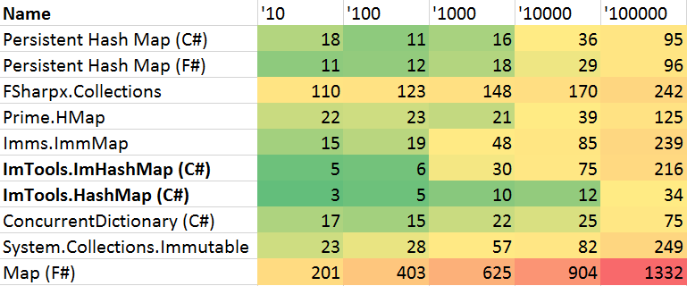
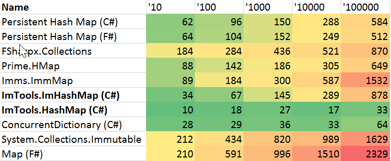
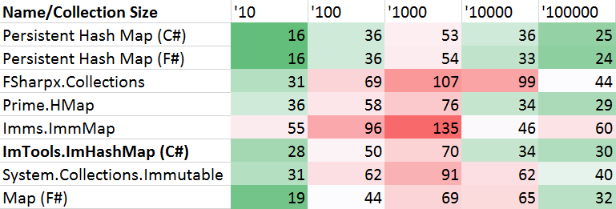
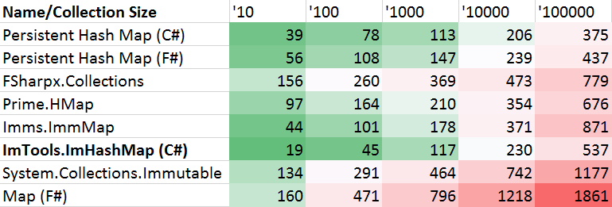
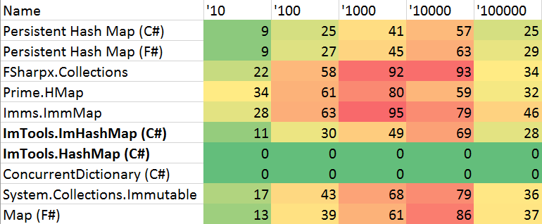

# ImTools

- Lib package: 
- Code package: 

Immutable persistent collections, Ref, and Array helpers designed for performance.

Note: concurrent HashMap from tests below is out until #1 is fixed.

Split from [DryIoc](https://bitbucket.org/dadhi/dryioc).

## Benchmarks

Based on [this great benchmark](https://gist.github.com/mrange/d6e7415113ebfa52ccb660f4ce534dd4) with F# and C# collections.

### Lookup

#### Speed

#### Memory

No GC count

### Insert

#### Speed

#### GC count

### Remove

#### Speed

#### GC count

## Usage Example

Let's assume you are implementing yet another DI container because why not :-)

Container should contain registry of `Type` to `Factory` mappings. 
On resolution `Factory` is compiled to the delegate which you would like to cache, because compilation is costly. 
The cache will store the mappings from `Type` to `Func<object>`.

__The requirements:__

- The container may be used in parallel from different threads including registrations and resolutions. 
- The container state should not be corrupted and the cache should correspond to the current state of registrations.

Let's design the basic container structure to support the requirements and __without locking__:

    public class Container
    {
        readonly Ref<Registry> _registry = Ref.Of(new Registry());

        public void Register<TService, TImpl>() where TImpl : TService =>
            _registry.Swap(reg => reg.With(typeof(TService), new Factory(typeof(TImpl))))

        public void Resolve<TService>() =>
            _registry.Value.Resolve(typeof(TService)) ?? ThrowUnableToResolve(typeof(TService));

        class Registry 
        {
            ImHashMap<Type, Factory> 
                _registrations = ImHashMap<Type, Factory>.Empty;

            Ref<ImHashMap<Type, Func<object>>> 
                _resolutionCache = Ref.Of(ImHashMap<Type, Func<object>>.Empty);

            public Registry With(Type serviceType, Factory implFactory) =>
                return new Registry {
                    _registrations = _registrations.AddOrUpdate(serviceType, implFactory),
                    
                    // Here is most interesting part:
                    // We are creating new independent reference pointing to cache value,
                    // isolating it from possible parallel resolutions, 
                    // which will swap older version/ref of cache and won't touch the new one.
                    _resolutionCache = Ref.Of(_resolutionCache.Value);
                };

            public object Resolve(Type serviceType)
            {
                var func = _resolutionCache.Value.GetValueOrDefault(serviceType);
                if (func != null)
                    return func();

                func = _registry.GetValueOrDefault(serviceType)?.CompileDelegate();
                if (func != null) 
                    _resolutionCache.Swap(cache => cache.AddOrUpdate(serviceType, func))

                return func?.Invoke();
            }
        }
    }
