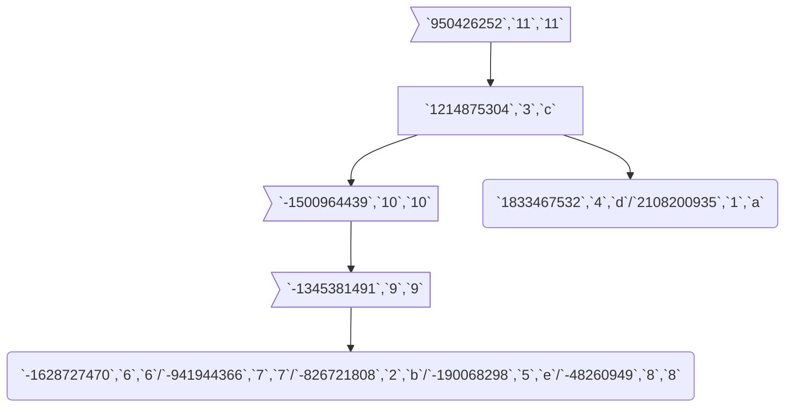

# ImHashMap Diagnostics

## Branch2Plus

### Adding to B2P

```mermaid
graph TD
L5_-1628727470(`-1628727470`,`6`,`6`/`-941944366`,`7`,`7`/`-826721808`,`2`,`b`/`-190068298`,`5`,`e`/`-48260949`,`8`,`8`)
L5P_-1345381491>`-1345381491`,`9`,`9`]-->L5_-1628727470
L5PP_-1500964439>`-1500964439`,`10`,`10`]-->L5P_-1345381491
L2_1833467532(`1833467532`,`4`,`d`/`2108200935`,`1`,`a`)
B2_1214875304[`1214875304`,`3`,`c`]-->L5PP_-1500964439
B2_1214875304-->L2_1833467532
B2P_950426252>`950426252`,`11`,`11`]-->B2_1214875304
```