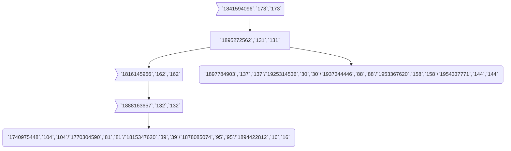
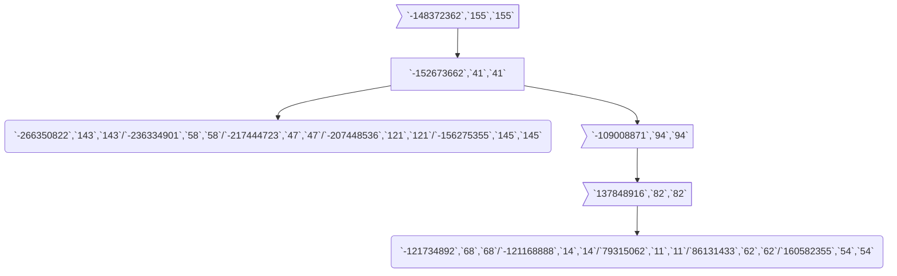

# ImHashMap Diagnostics

## Branch2Plus

### Adding to right of B2P

```mermaid
graph TD
L5_1740975448(`1740975448`,`104`,`104`/`1770304590`,`81`,`81`/`1815347620`,`39`,`39`/`1878085074`,`95`,`95`/`1894422812`,`16`,`16`)
L5P_1888163657>`1888163657`,`132`,`132`]-->L5_1740975448
L5PP_1816145966>`1816145966`,`162`,`162`]-->L5P_1888163657
L5_1897784903(`1897784903`,`137`,`137`/`1925314536`,`30`,`30`/`1937344446`,`88`,`88`/`1953367620`,`158`,`158`/`1954337771`,`144`,`144`)
B2_1895272562[`1895272562`,`131`,`131`]-->L5PP_1816145966
B2_1895272562-->L5_1897784903
B2P_1841594096>`1841594096`,`173`,`173`]-->B2_1895272562
```

### Adding to left of B2P

```mermaid
graph TD
L5_-266350822(`-266350822`,`143`,`143`/`-236334901`,`58`,`58`/`-217444723`,`47`,`47`/`-207448536`,`121`,`121`/`-156275355`,`145`,`145`)
L5_-121734892(`-121734892`,`68`,`68`/`-121168888`,`14`,`14`/`79315062`,`11`,`11`/`86131433`,`62`,`62`/`160582355`,`54`,`54`)
L5P_137848916>`137848916`,`82`,`82`]-->L5_-121734892
L5PP_-109008871>`-109008871`,`94`,`94`]-->L5P_137848916
B2_-152673662[`-152673662`,`41`,`41`]-->L5_-266350822
B2_-152673662-->L5PP_-109008871
B2P_-148372362>`-148372362`,`155`,`155`]-->B2_-152673662

```